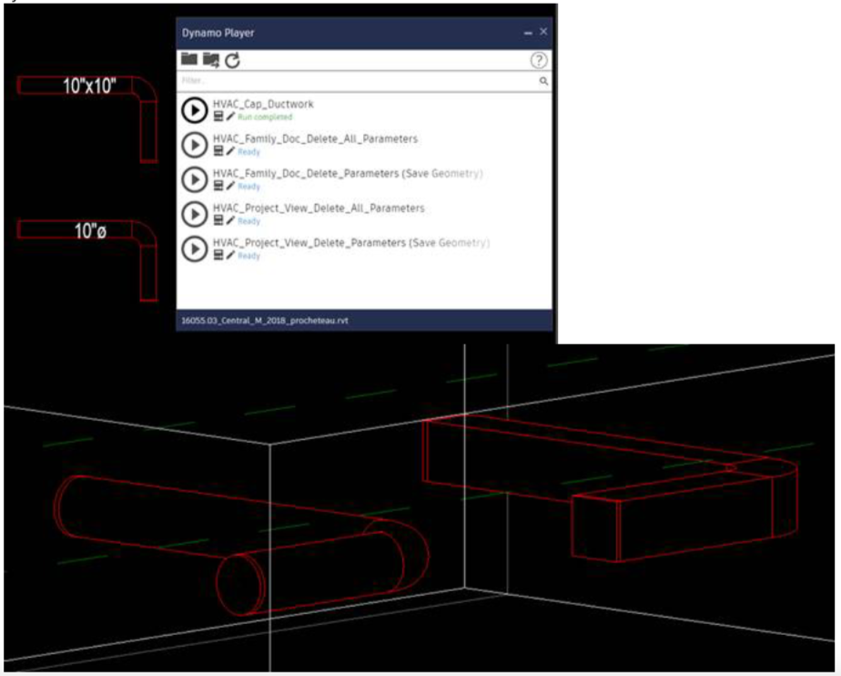

# Dynamo-HVAC Cap Ductwork

By applying Dynamo and Python scripts, I was able to automate the capping of open ductwork in a 3D Autodesk Revit building model. The Cap_Ductwork script utilizes the Revit API to locate all uncapped ductwork in a model. New cap elements are then created, sized, oriented, and connected to the ductwork openings.

 

##### Ductwork Capped

